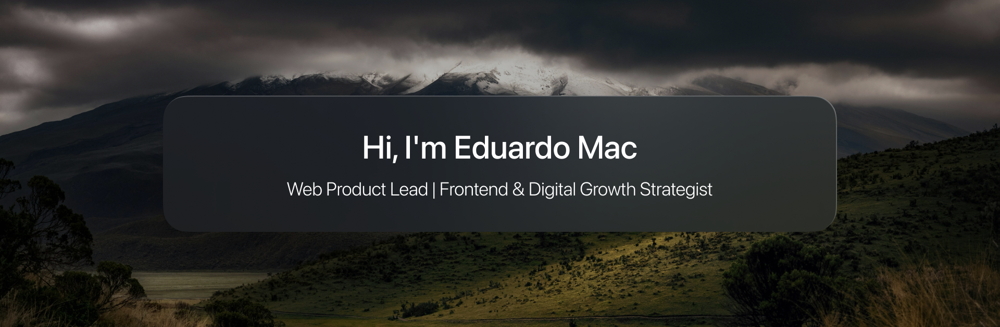

  

 
  
  <h3>About me</h3>

Frontend developer and web product lead with a graphic design background — I bridge UX/UI, growth strategy, and hands-on code rather than treating them as separate disciplines. My experience spans insurtech and product companies (GPI, Aura Vive Seguro, MIURABOX), covering everything from SEO-driven marketing sites to full product builds. AI-assisted development — Claude Code, Cursor — is a core part of how I build today, not a novelty. Currently open to new frontend / product opportunities.

---

  
  <h3>Main Skills</h3>

- Design:
  
  

    
    
    
  

  
- Languages:
  
  
  
  
  

- Frameworks, Platforms and Libraries:
  
  
  
  
  
  
  

  
  
  

- Version Control:

  
  
  

- AI-Assisted Development:

  
  
  
   

 
- Digital Marketing:
  
  

    
    
    
    
  

---

- RRSS:

  

    
    
    
  

